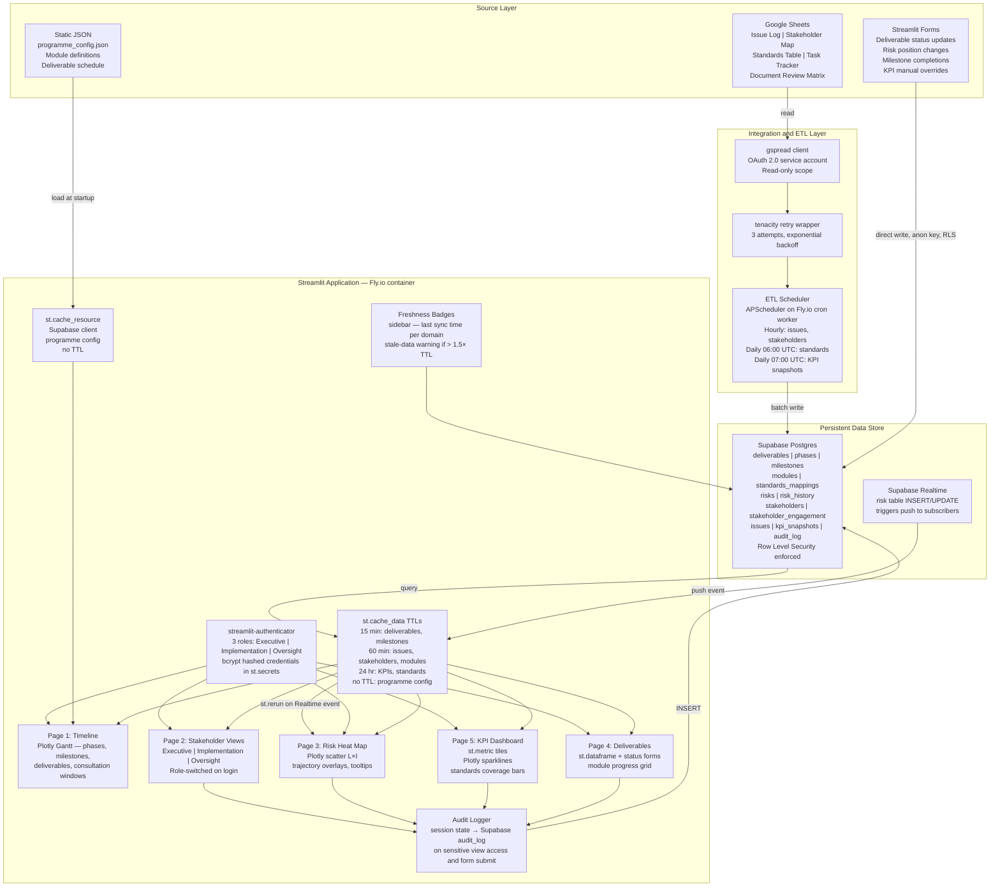

# Data Integration and Real-Time Update Architecture Guide
## IOM Lebanon / GSD Curriculum Development Consultancy — Streamlit Dashboard

---

## Executive Summary

This guide defines the data integration architecture for a live Streamlit dashboard serving the IOM Lebanon / GSD Curriculum Development Consultancy (Consultant: Saleh Mansour, start date 25 May 2026). The static design — five views covering a luxury-branded programme timeline, stakeholder-specific views, risk heat map, deliverables tracker, and KPI dashboards — becomes a live application by connecting to a lightweight data stack: Google Sheets as the operational tracker layer (issue log, stakeholder map, task checklists), Supabase (Postgres) as the persistent backing store for historical series and audit trails, and Streamlit form-based manual entry for status updates that have no upstream system of record. A scheduled ETL job (APScheduler in a Fly.io cron sidecar) pulls Google Sheets data hourly and writes to Supabase. The Streamlit front end reads exclusively from Supabase with `st.cache_data` TTLs tuned per data domain. Three roles — Executive, Implementation, Oversight — map directly to the stakeholder groups in the TOR and drive view-level and field-level access control enforced in the data layer before data reaches Python. The full stack (Streamlit on Fly.io plus Supabase free tier) costs under USD 20/month for a four-month programme and can be live with the core deliverables view within two weeks of build start.

---

## 1. Data Mapping Matrix

### 1.1 Programme Metadata

| TOR / Action Plan Field | Definition and Data Type | Dashboard View(s) | Streamlit Component | Source System | Source Field | Transformation | Owner |
|---|---|---|---|---|---|---|---|
| Programme title | "GSD Curriculum Development Consultancy" — string, static | Timeline header, all views sidebar | `st.sidebar` custom HTML title band | Static JSON | `programme.title` | None | Consultant |
| Contracting organisation | "IOM Lebanon" — string, static | All views header | `st.sidebar` logo + label | Static JSON | `programme.org` | None | Consultant |
| Beneficiary institution | "General Directorate of General Security (GSD)" — string, static | All views | `st.sidebar` label | Static JSON | `programme.beneficiary` | None | Consultant |
| Consultant name | "Saleh Mansour" — string, static (TOR §1) | Implementation view header; audit log | `st.sidebar`; session state display | Static JSON | `programme.consultant` | None | Consultant |
| Duty station | "Beirut, Lebanon" — string, static (TOR §1) | Timeline header | Custom HTML badge | Static JSON | `programme.duty_station` | None | Consultant |
| Programme start date | 2026-05-25 — date (Action Plan cover) | Timeline Gantt origin | `st.plotly_chart` Gantt x-axis start | Static JSON | `programme.start_date` | `datetime.date` parse | Consultant |
| Programme duration | 4 months = 120 days — integer (TOR §2) | Timeline Gantt end bound | Gantt x-axis upper bound | Static JSON | `programme.duration_days` | Derived: `start_date + duration_days` | Consultant |
| Contract value | Confidential total — float, optional | Executive view only (if enabled) | `st.metric` (redacted unless IBG PM role) | Manual entry / Supabase | `contract.total_value` | `ASSUMPTION:` currency display as USD — confirm with IOM programme policy at build time | IBG PM |
| Deliverable payment percentages | D1=20%, D2=20%, D3=30%, D4=30% — list[float] (TOR §6) | Executive view payment milestone tracker | `st.progress` bar per deliverable | Static JSON | `deliverable.payment_pct` | Multiply by total contract value if disclosed | IBG PM |
| Reporting line — direct | "IBG Programme Manager" — string, static (TOR §3) | Executive / Oversight sidebar | `st.info` box | Static JSON | `programme.reporting_line.direct` | None | Consultant |
| Reporting line — overall | "IOM Lebanon Head of Office" — string, static (TOR §3) | Executive / Oversight sidebar | `st.info` box | Static JSON | `programme.reporting_line.overall` | None | Consultant |

---

### 1.2 Phases and Milestones

| TOR / Action Plan Field | Definition and Data Type | Dashboard View(s) | Streamlit Component | Source System | Source Field | Transformation | Owner |
|---|---|---|---|---|---|---|---|
| Phase name | "Needs Assessment and Mapping", "Curriculum Design", "Validation and Finalization" — string (TOR §3) | Timeline phase bands, all views | `st.plotly_chart` Gantt phase band, colour-coded | Static JSON | `phase.name` | None | Consultant |
| Phase start / end week | Wk1–4, Wk5–8, Wk9–10 — integer (TOR §3) | Timeline Gantt | Gantt x-axis range | Static JSON | `phase.start_week`, `phase.end_week` | `start_date + (week - 1) * 7` days | Consultant |
| Phase status | enum: not_started / in_progress / complete — string | Timeline phase band colour; KPI view | Gantt bar fill; `st.badge` via custom CSS | Supabase `phases` | `phase.status` | Derived: any deliverable in phase submitted → in_progress; all approved → complete | IBG PM |
| Milestone: Document request submitted | boolean + date — Day 1 Action Plan, Action 03 | Timeline scatter marker; Implementation view | Plotly scatter marker on Gantt | Supabase `milestones` | `milestone.doc_request_submitted` | None | Consultant |
| Milestone: GSD focal point confirmed | boolean + date — Day 1, Action 02 | Timeline; Implementation view | Plotly scatter marker | Supabase `milestones` | `milestone.gsd_fp_confirmed` | None | Consultant |
| Milestone: Issue log opened | boolean + date — Day 1, Action 05 | Implementation view | Plotly scatter marker | Supabase `milestones` | `milestone.issue_log_opened` | None | Consultant |
| Milestone: Stakeholder map drafted | boolean + date — Day 3 Action Plan | Timeline; Implementation view | Plotly scatter marker | Supabase `milestones` | `milestone.stakeholder_map_drafted` | None | Consultant |
| Milestone: Instruments drafted | boolean + date — Day 4 Action Plan | Implementation view | Plotly scatter marker | Supabase `milestones` | `milestone.instruments_drafted` | None | Consultant |
| Milestone: ≥3 Week-2 consultations confirmed | integer count + boolean — Day 5 Action Plan | Implementation view | `st.metric` with delta | Supabase `milestones` | `milestone.wk2_consultations_confirmed` | None | Consultant |
| Milestone: Inception Report submitted | boolean + date — Day 10 Action Plan (TOR §6 D1) | Timeline all views; KPI | Gantt diamond marker; `st.metric` | Supabase `milestones` | `milestone.d1_submitted` | None | Consultant |
| Milestone: Validation Workshop held | boolean + date — TOR §6 D4a, Week 9 | Timeline; Executive view | Gantt diamond marker | Supabase `milestones` | `milestone.validation_workshop_held` | None | IBG PM |
| Milestone: Final Curriculum submitted | boolean + date — TOR §6 D4b, Week 10 | Timeline; all views | Gantt diamond marker; programme-complete banner | Supabase `milestones` | `milestone.d4b_submitted` | None | Consultant |

---

### 1.3 Deliverables

| TOR / Action Plan Field | Definition and Data Type | Dashboard View(s) | Streamlit Component | Source System | Source Field | Transformation | Owner |
|---|---|---|---|---|---|---|---|
| Deliverable ID | "D1"–"D4b" — string | All views (row key) | Grid row key | Static JSON | `deliverable.id` | None | Consultant |
| Deliverable name | e.g., "Inception Report" — string (TOR §6) | Deliverables grid; Timeline bar label | `st.dataframe` column; Gantt bar label | Static JSON | `deliverable.name` | None | Consultant |
| Deliverable description | Full TOR §6 description — string | Deliverables view expandable row; Oversight | `st.expander` or `st.popover` | Static JSON | `deliverable.description` | None | Consultant |
| TOR due date | Wk-relative → absolute date: D1=06 Jun, D2=~20 Jun, D3=~18 Jul, D4a=~25 Jul, D4b=~01 Aug 2026 — date (TOR §6) | All views | Gantt end-marker; `st.dataframe` column; `st.metric` days remaining | Static JSON | `deliverable.due_date` | `start_date + (target_week * 7) - 1` | Consultant |
| Actual submission date | Date submitted or null — date (TOR §6) | Deliverables view; KPI timeliness | `st.dataframe` column, conditional colour | Supabase `deliverables` | `deliverable.submitted_at` | `variance_days = submitted_at - due_date`; negative = early | Consultant |
| Deliverable status | enum: not_started / in_progress / submitted / under_review / approved / rejected — string | Deliverables view; Timeline bar fill; Executive view | `st.dataframe` colour badge; Gantt fill | Supabase `deliverables` | `deliverable.status` | State machine; transitions logged to `deliverable_status_history` | IBG PM |
| Payment percentage | 20% / 20% / 30% / 30% — float (TOR §6) | Executive view payment tracker | `st.progress`; `st.metric` | Static JSON | `deliverable.payment_pct` | Applied to contract total if disclosed | IBG PM |
| Quality gate stage | enum: draft / internal_review / iom_review / approved — string | Oversight view; Deliverables view | Custom HTML badge (CSS-injected) | Supabase `deliverables` | `deliverable.quality_gate` | None | IBG PM |
| Reviewer | "IBG Programme Manager" — string | Oversight view | `st.dataframe` column | Supabase `deliverables` | `deliverable.reviewer` | None | IBG PM |
| Days to deadline | Computed integer — derived | Deliverables view | `st.metric` with delta | Computed | `due_date - date.today()` | Recomputed on each page load; not cached | N/A |
| Variance days | Computed integer, nullable — derived | Deliverables view; KPI timeliness | `st.dataframe` column; colour: negative=green, positive=red | Computed from Supabase | `submitted_at - due_date` | Null until submitted | N/A |

---

### 1.4 Curriculum Modules

| TOR / Action Plan Field | Definition and Data Type | Dashboard View(s) | Streamlit Component | Source System | Source Field | Transformation | Owner |
|---|---|---|---|---|---|---|---|
| Module ID | "M01"–"M10" — string (TOR §3 Phase 2) | Deliverables view module grid; Implementation view | `st.dataframe` row key | Static JSON / Supabase | `module.id` | None | Consultant |
| Module title | e.g., "Integrated Border Management Principles" — string (TOR §3 ten modules) | Deliverables view; Oversight | `st.dataframe` column | Static JSON | `module.title` | None | Consultant |
| Module status | enum: not_started / outline_complete / draft_complete / standards_aligned / finalized — string | Deliverables view module progress grid; Implementation view | `st.dataframe` colour badge; `st.progress` aggregate | Supabase `modules` | `module.status` | Aggregate: count(finalized) / 10 = curriculum completion KPI | Consultant |
| Standards mapped (list) | List of source document names — list[string] (Day 2 Standards Reference Table) | Oversight view standards coverage | `st.expander` per module with standards list | Supabase `standards_mappings` JOIN `standards_reference` | `WHERE module_id = M0x` | None | Consultant |
| Standards mapped (count) | Integer — count of standards entries for this module | Implementation view; Oversight | `st.metric` | Supabase `standards_mappings` | `COUNT WHERE module_id = M0x` | SQL aggregate | Consultant |
| Applicable deliverable | "D3" for all modules (TOR §6) | Deliverables view (module-to-deliverable linkage) | `st.dataframe` column | Static JSON | `module.applicable_deliverable` | None | Consultant |

---

### 1.5 Stakeholders

| TOR / Action Plan Field | Definition and Data Type | Dashboard View(s) | Streamlit Component | Source System | Source Field | Transformation | Owner |
|---|---|---|---|---|---|---|---|
| Organisation / Unit | e.g., "GSD Training Academy" — string (Action Plan Day 3) | Stakeholder view grid; Implementation view | `st.dataframe` | Google Sheets "Stakeholder Map" tab | Column A | None | Consultant |
| Key contact name and title | String, nullable — PII (Action Plan Day 3) | Implementation view only | `st.dataframe` (role-filtered at data layer) | Google Sheets | Column B / C | `ASSUMPTION:` PII shown only to Implementation role; stripped from Executive and Oversight queries via RLS | Consultant |
| Role in consultancy | enum: informant / reviewer / approver / end_user — string (Action Plan Day 3) | Stakeholder view | `st.dataframe` column | Google Sheets | Column D | None | Consultant |
| Consultation method | enum: interview / focus_group / document_review / workshop — string (Action Plan Day 3) | Implementation view | `st.dataframe` column | Google Sheets | Column E | None | Consultant |
| Access status | enum: confirmed / pending / to_be_requested — string (Action Plan Day 3) | Implementation view | `st.dataframe` colour badge | Google Sheets | Column F | None | Consultant |
| Scheduled consultation window | Date range — string or date pair (Action Plan Day 3) | Timeline secondary layer; Implementation view | Plotly Gantt secondary bars | Google Sheets | Column G | Parse date range strings → `(date_start, date_end)` tuple via regex or `pd.to_datetime` | Consultant |
| Actor category | enum: GSD_leadership / GSD_academy / GSD_operational / GSD_legal_it / IOM / national_partner / international_partner — string (Action Plan Day 3 full actor list) | All views filter; KPI stakeholder coverage | `st.selectbox` filter sidebar | Supabase `stakeholders` (ETL-derived from Google Sheets) | `actor_category` | Category mapping applied at ETL ingest: org name → category enum | Consultant |
| Engagement score | Float 0–10 — `ASSUMPTION:` manual consultant rating of consultation quality recorded post-KII | Executive KPI view; Oversight view | `st.metric`; Plotly radar chart per actor category | Supabase `stakeholder_engagement` | `engagement.score` | Aggregate: mean per actor category for radar chart | Consultant |

---

### 1.6 Issue Log

| TOR / Action Plan Field | Definition and Data Type | Dashboard View(s) | Streamlit Component | Source System | Source Field | Transformation | Owner |
|---|---|---|---|---|---|---|---|
| Issue number | Sequential integer (Action Plan Day 1, Action 05) | Implementation view issue log table | `st.dataframe` row key | Google Sheets "Issue Log" tab | Column A | None | Consultant |
| Date raised | Date (Action Plan Day 1) | Implementation view | `st.dataframe` column | Google Sheets | Column B | `pd.to_datetime` | Consultant |
| Description | Free text (Action Plan Day 1) | Implementation view full text; expandable | `st.dataframe` with `st.expander` | Google Sheets | Column C | None | Consultant |
| Category | enum: access / document / coordination / scope — string (Action Plan Day 1, Action 05 column spec) | Implementation view filter; Risk heat map feed | `st.dataframe` colour chip | Google Sheets | Column D | Mapped to risk category for heat map cross-reference | Consultant |
| Risk level | enum: high / medium / low — string (Action Plan Day 1) | Risk heat map; Implementation view | `st.dataframe` badge; heat map feed | Google Sheets | Column E | high→5, medium→3, low→1 for heat map axis mapping | Consultant |
| Assigned to | Name — string (Action Plan Day 1) | Implementation view | `st.dataframe` column | Google Sheets | Column F | None | IBG PM |
| Target resolution date | Date (Action Plan Day 1) | Implementation view; overdue flagging | `st.dataframe`; overdue = red if `today > target AND status != resolved` | Google Sheets | Column G | `pd.to_datetime`; derive `is_overdue` boolean | Consultant |
| Status | enum: open / resolved / escalated — string (Action Plan Day 1) | Implementation view; KPI open issues count | `st.dataframe` badge; `st.metric` | Google Sheets | Column H | None | Consultant |

---

### 1.7 Risk Register

| TOR / Action Plan Field | Definition and Data Type | Dashboard View(s) | Streamlit Component | Source System | Source Field | Transformation | Owner |
|---|---|---|---|---|---|---|---|
| Risk ID | "R001"–"R00n" — string | Risk heat map; Oversight view | Plotly scatter point label; grid row key | Supabase `risks` | `risk.id` | None | Consultant |
| Risk description | e.g., "Document access delay" — string (Action Plan Day 1 Risk Flags, three named risks) | Risk heat map hover tooltip; Oversight view | Plotly hover text; `st.dataframe` | Supabase `risks` | `risk.description` | None | Consultant |
| Category | enum: access / coordination / scope / delivery — string | Risk heat map colour by category | Plotly marker colour | Supabase `risks` | `risk.category` | None | Consultant |
| Likelihood | Integer 1–5 — `ASSUMPTION:` 5-point scale; action plan "high probability" risks mapped to likelihood=4; medium-probability=3 | Risk heat map y-axis | `st.plotly_chart` scatter y | Supabase `risks` | `risk.likelihood` | Import mapping: high→4, medium→3, low→1 | Consultant |
| Impact | Integer 1–5 — `ASSUMPTION:` same scale; "directly compresses needs assessment window" (Action Plan Day 1) = impact=5 | Risk heat map x-axis | `st.plotly_chart` scatter x | Supabase `risks` | `risk.impact` | Same mapping logic as likelihood | Consultant |
| Mitigation description | String (Action Plan Day 1 Risk Flags full text) | Oversight view; Risk heat map tooltip | `st.expander`; Plotly tooltip | Supabase `risks` | `risk.mitigation` | None | Consultant |
| Escalation trigger | String (Action Plan Day 1 Risk Flags full text) | Oversight view | `st.dataframe` expandable cell | Supabase `risks` | `risk.escalation_trigger` | None | IBG PM |
| Status | enum: active / mitigated / escalated / closed — string | Risk heat map marker shape; Oversight view | Plotly marker symbol (circle=active, square=mitigated, x=escalated, diamond=closed) | Supabase `risks` | `risk.status` | None | IBG PM |
| Risk position history | List of (date, likelihood, impact) tuples — list[dict] | Risk heat map trajectory overlay | Plotly line trace connecting historical positions | Supabase `risk_history` | `SELECT * FROM risk_history WHERE risk_id = ?` | Ordered by date ascending; line drawn through positions | Consultant |
| Owner | Name — string | Oversight view | `st.dataframe` column | Supabase `risks` | `risk.owner` | None | IBG PM |

---

### 1.8 KPIs

| TOR / Action Plan Field | Definition and Data Type | Dashboard View(s) | Streamlit Component | Source System | Source Field | Transformation | Owner |
|---|---|---|---|---|---|---|---|
| KPI: Stakeholder Engagement Effectiveness | % of seven defined actor categories with ≥1 confirmed consultation — float 0–100 (TOR §7: "effective coordination and engagement") | KPI view (Executive, Oversight) | `st.metric` + Plotly gauge | Supabase `stakeholder_engagement` | `COUNT(DISTINCT actor_category WHERE access_status='confirmed') / 7 * 100` | 7 = number of actor categories defined in Action Plan Day 3 | Consultant |
| KPI: Delivery Timeliness | Days variance per deliverable; aggregate on-time % — float (TOR §7: "timely submission of all deliverables") | KPI view; Executive view | `st.metric` variance per deliverable; Plotly bar chart | Supabase `deliverables` | `submitted_at - due_date` per deliverable | Positive = late; negative = early; null submitted_at = not yet submitted | IBG PM |
| KPI: Curriculum Standards Coverage | % of 10 modules with full standards alignment documented (TOR §7: "high-quality materials fully aligned with IOM IBG framework") | KPI view; Oversight view | `st.metric`; Plotly horizontal bar per module | Supabase `modules` JOIN `standards_mappings` | `COUNT(status IN ['standards_aligned','finalized']) / 10 * 100` | None | Consultant |
| KPI: Open Issues Count | Count of issues with status=open — integer | KPI view; Implementation view | `st.metric` with week-over-week delta | Supabase `issues` (ETL mirror of Google Sheets) | `COUNT WHERE status='open'` | Delta = current count minus prior week snapshot | Consultant |
| KPI: Curriculum Completion | % of 10 modules at finalized status — float 0–100 | KPI view; Executive view | `st.metric`; `st.progress` bar | Supabase `modules` | `COUNT(status='finalized') / 10 * 100` | None | Consultant |
| Trend series (all KPIs) | List of (date, value) pairs — list[dict] | KPI view sparkline charts | Plotly line chart (sparkline format inside metric card) | Supabase `kpi_snapshots` | `SELECT * FROM kpi_snapshots WHERE kpi_id=? ORDER BY snapshot_date` | Daily snapshots written by ETL at 07:00 UTC | ETL scheduler |

---

### 1.9 Standards Reference Table

| TOR / Action Plan Field | Definition and Data Type | Dashboard View(s) | Streamlit Component | Source System | Source Field | Transformation | Owner |
|---|---|---|---|---|---|---|---|
| Source document | e.g., "ICAO Doc 9303" — string (Day 2 Action Plan, 12 entries in standards reference table) | Oversight view standards coverage grid | `st.dataframe` | Google Sheets "Standards Reference" tab | Column A | None | Consultant |
| Standard / principle extracted | Descriptive string (Day 2 standards table) | Oversight view | `st.dataframe` column | Google Sheets | Column B | None | Consultant |
| Applicable module(s) | List of module IDs — list[string] (Day 2 standards table Column C) | Oversight view; module detail panel | `st.dataframe` multi-value cell; module progress overlay | Google Sheets | Column C | Parse comma-separated module IDs → Python list at ETL ingest | Consultant |
| Mapping status | enum: pending / mapped / validated — string — `ASSUMPTION:` not specified in source material; inferred from programme phase logic | Oversight view | `st.dataframe` colour badge | Supabase `standards_mappings` | `standards_mappings.status` | Manual override in Supabase if Google Sheets sync is insufficient | Consultant |
## 2. API Integration Points and Refresh Cadence

### 2.1 Source Systems

The TOR and action plan specify no enterprise PM tool. The realistic infrastructure for a single consultant on an IOM engagement is:

1. **Google Sheets** — issue log, stakeholder map, task checklists, standards reference table, document review matrix. Maintained manually by the consultant during daily work.
2. **Supabase (Postgres)** — persistent backing store for all dashboard-ready data: deliverables, risks, modules, KPI snapshots, audit logs, and anything requiring historical series.
3. **Streamlit forms** — inline manual entry for status updates (deliverable status transitions, risk position changes, milestone completions) where no upstream system of record exists.
4. **Static JSON** — programme metadata, module definitions, deliverable payment percentages. Committed to the repo. Updated only if the TOR is formally amended.

`ASSUMPTION:` No Asana, Monday.com, Jira, or Smartsheet instance exists. If the IOM programme office uses an internal PM platform, the Google Sheets integration layer should be replaced with that platform's API. The transformation logic is identical.

`ASSUMPTION:` No financial system integration is required. Contract value and payment milestone data are entered manually by the IBG PM.

---

### 2.2 Integration Method per Source System

**Google Sheets**

| Property | Detail |
|---|---|
| Library | `gspread` Python library |
| Auth | Google service account JSON key, stored in `st.secrets["gcp_service_account"]` or `GOOGLE_SERVICE_ACCOUNT_JSON` env var. Read-only scope: `spreadsheets.readonly`. Rotate key every 90 days. |
| Sheets pulled | "Stakeholder Map", "Issue Log", "Standards Reference", "Task Tracker", "Document Review Matrix" |
| Refresh | Hourly (issues, stakeholders, task tracker); daily 06:00 UTC (standards reference) |
| Rate limit note | Verify current Google Sheets API quota at developers.google.com/sheets/api/limits before build — quota applies per project and per user. |

**Supabase (Postgres)**

| Property | Detail |
|---|---|
| Library | `supabase-py` client for Streamlit front end; `psycopg2` for ETL batch writes |
| Auth | `SUPABASE_URL` + `SUPABASE_ANON_KEY` in `st.secrets` for Streamlit (anon key, RLS enforced). `SUPABASE_SERVICE_ROLE_KEY` in ETL sidecar environment only — never in the Streamlit process. |
| Tables | `deliverables`, `deliverable_status_history`, `phases`, `milestones`, `modules`, `standards_mappings`, `risks`, `risk_history`, `stakeholders`, `stakeholder_engagement`, `issues` (ETL mirror), `kpi_snapshots`, `audit_log`, `etl_sync_log` |
| Realtime | Enabled on `risks` table only — near-real-time risk escalation alerts in the dashboard |
| Verify | Confirm Realtime subscription syntax and RLS policy DSL at supabase.com/docs before build. |

**Streamlit Forms (manual entry)**

| Property | Detail |
|---|---|
| Widgets | `st.form`, `st.selectbox`, `st.date_input`, `st.slider`, `st.text_area` |
| Auth | Session-level role check controls form visibility. Form submissions write to Supabase via `supabase-py` with anon key; RLS enforces that only the correct role can insert/update. |
| Data entered | Deliverable status transitions (Consultant / IBG PM); risk likelihood/impact updates (Consultant); milestone completion checkboxes (Consultant); KPI manual overrides (IBG PM) |
| Refresh trigger | Immediate: form `on_submit` calls `st.cache_data.clear()` for the affected domain, then `st.rerun()` |

**Static JSON**

| Property | Detail |
|---|---|
| Load pattern | `st.cache_resource` — loaded once at app startup, retained in memory for all sessions, no TTL |
| Location | `/app/data/programme_config.json` — committed to repo |
| Refresh | Only on application redeployment. TOR amendment triggers a manual update. |

---

### 2.3 Refresh Cadence Table

| Data Domain | Frequency | Reasoning | Implementation |
|---|---|---|---|
| Risk status changes | Near-real-time | Risk escalations must appear immediately in Executive and Oversight views. A high-risk escalation sitting stale for an hour is operationally unacceptable during active consultation weeks. | Supabase Realtime subscription on `risks` table; callback triggers `st.rerun()` |
| Issue log | Hourly | Issues are updated multiple times per day during Weeks 1–4. Hourly cadence balances freshness against Google API quota. | `st.cache_data(ttl=3600)` on `fetch_issues()`; ETL sync at :00 each hour |
| Stakeholder engagement | Hourly | Access status and confirmed consultation windows change frequently in Weeks 1–4 | `st.cache_data(ttl=3600)` on `fetch_stakeholders()`; hourly ETL |
| Deliverable status | 15 minutes | Status transitions are low-frequency but high-visibility. 15-minute cache prevents a stale Executive view without creating rate-limit pressure on Supabase. | `st.cache_data(ttl=900)` on `fetch_deliverables()` |
| Milestone completions | 15 minutes | Same reasoning as deliverables | `st.cache_data(ttl=900)` |
| Curriculum module status | Hourly | Consultant updates module status once or twice per working session, not continuously | `st.cache_data(ttl=3600)` on `fetch_modules()` |
| KPI calculations | Daily at 07:00 UTC | KPIs aggregate daily work; intra-day recalculation produces misleading noise. Daily snapshot also provides the trend series needed for sparklines. | ETL scheduler writes `kpi_snapshots` at 07:00 UTC; `st.cache_data(ttl=86400)` on KPI fetch |
| Standards reference | Daily at 06:00 UTC | Stable once the Day 2 desk review is complete. No intra-day updates expected. | `st.cache_data(ttl=86400)` |
| Programme metadata | Static (deploy-time) | Never changes mid-programme without a TOR amendment and redeployment | `st.cache_resource()` — no TTL |
| Audit log | Write-only, immediate | No caching. Written synchronously on each user action requiring logging. | Direct Supabase insert; no cache layer |

---

### 2.4 Architecture Diagram



---

### 2.5 ETL Scheduler

```python
# etl/scheduler.py
# Runs as a separate Fly.io Machine (cron worker) — not inside the Streamlit process.
# Keeping ETL out of the Streamlit process avoids blocking session threads.

from apscheduler.schedulers.blocking import BlockingScheduler
from etl.sheets_sync import sync_issue_log, sync_stakeholders, sync_standards
from etl.kpi_calculator import calculate_and_snapshot_kpis
import logging

logging.basicConfig(level=logging.INFO)
scheduler = BlockingScheduler(timezone="Asia/Beirut")  # UTC+3, Lebanon

# Hourly syncs
scheduler.add_job(sync_issue_log,    "interval", hours=1, id="sync_issues",       jitter=60)
scheduler.add_job(sync_stakeholders, "interval", hours=1, id="sync_stakeholders", jitter=60)

# Daily jobs — stagger by 1 hour to avoid simultaneous Supabase writes
scheduler.add_job(sync_standards,            "cron", hour=6, minute=0,  id="sync_standards")
scheduler.add_job(calculate_and_snapshot_kpis, "cron", hour=7, minute=0, id="kpi_snapshot")

if __name__ == "__main__":
    scheduler.start()
```

```python
# etl/sheets_sync.py

import gspread
import pandas as pd
import streamlit as st
from tenacity import retry, stop_after_attempt, wait_exponential
import os, json
from datetime import datetime, timezone

SPREADSHEET_ID = os.environ["GOOGLE_SPREADSHEET_ID"]
CREDENTIALS    = json.loads(os.environ["GOOGLE_SERVICE_ACCOUNT_JSON"])

@retry(stop=stop_after_attempt(3), wait=wait_exponential(multiplier=1, min=4, max=30))
def _fetch_sheet(sheet_name: str) -> list[dict]:
    gc = gspread.service_account_from_dict(CREDENTIALS)
    return gc.open_by_key(SPREADSHEET_ID).worksheet(sheet_name).get_all_records()

def sync_issue_log():
    from db import get_db_client  # psycopg2 connection
    rows = _fetch_sheet("Issue Log")
    df = pd.DataFrame(rows)
    # Normalise column names to snake_case
    df.columns = [c.lower().replace(" ", "_") for c in df.columns]
    df["synced_at"] = datetime.now(timezone.utc)
    conn = get_db_client()
    # Upsert: on conflict on issue_number, update all fields
    # Use psycopg2 execute_values for performance
    _upsert_dataframe(conn, "issues", df, conflict_col="issue_number")
    _log_sync(conn, "issues")

def sync_stakeholders():
    from db import get_db_client
    rows = _fetch_sheet("Stakeholder Map")
    df = pd.DataFrame(rows)
    df.columns = [c.lower().replace(" ", "_") for c in df.columns]
    # Apply actor_category mapping
    df["actor_category"] = df["organisation___unit"].map(ACTOR_CATEGORY_MAP).fillna("national_partner")
    df["synced_at"] = datetime.now(timezone.utc)
    conn = get_db_client()
    _upsert_dataframe(conn, "stakeholders", df, conflict_col="id")
    _log_sync(conn, "stakeholders")

ACTOR_CATEGORY_MAP = {
    "GSD Training Academy":         "GSD_academy",
    "GSD Leadership":               "GSD_leadership",
    "GSD Land Borders":             "GSD_operational",
    "GSD Airport Unit":             "GSD_operational",
    "GSD Maritime Unit":            "GSD_operational",
    "GSD Legal Unit":               "GSD_legal_it",
    "GSD IT/Data Unit":             "GSD_legal_it",
    "IOM Lebanon IBG":              "IOM",
    "Lebanese Armed Forces":        "national_partner",
    "Lebanese Customs":             "national_partner",
    "Ministry of Public Health":    "national_partner",
    "Ministry of Interior":         "national_partner",
    "UNHCR Lebanon":                "international_partner",
    "UNODC":                        "international_partner",
    "European Union":               "international_partner",
    "INTERPOL":                     "international_partner",
}
```

---

### 2.6 Caching Implementation in Streamlit

```python
# data/queries.py

import streamlit as st
import pandas as pd
from supabase import create_client

@st.cache_resource
def get_supabase_client():
    return create_client(st.secrets["SUPABASE_URL"], st.secrets["SUPABASE_ANON_KEY"])

@st.cache_resource
def load_programme_config() -> dict:
    import json
    with open("data/programme_config.json") as f:
        return json.load(f)

@st.cache_data(ttl=900)   # 15 minutes
def fetch_deliverables() -> pd.DataFrame:
    client = get_supabase_client()
    rows = client.table("deliverables").select(
        "id, name, due_date, payment_pct, status, submitted_at, quality_gate, reviewer"
    ).execute().data
    df = pd.DataFrame(rows)
    df["days_to_deadline"] = (pd.to_datetime(df["due_date"]) - pd.Timestamp.today()).dt.days
    df["variance_days"] = (
        pd.to_datetime(df["submitted_at"]) - pd.to_datetime(df["due_date"])
    ).dt.days
    return df

@st.cache_data(ttl=60)    # 60-second fallback; Realtime handles live push
def fetch_risks() -> pd.DataFrame:
    client = get_supabase_client()
    rows = client.table("risks").select("*, risk_history(date, likelihood, impact, status)").execute().data
    return pd.DataFrame(rows)

@st.cache_data(ttl=3600)  # hourly
def fetch_issues() -> pd.DataFrame:
    client = get_supabase_client()
    rows = client.table("issues").select("*").execute().data
    return pd.DataFrame(rows)

@st.cache_data(ttl=86400) # daily
def fetch_kpi_snapshots(kpi_id: str) -> pd.DataFrame:
    client = get_supabase_client()
    rows = client.table("kpi_snapshots").select("snapshot_date, value").eq(
        "kpi_id", kpi_id
    ).order("snapshot_date").execute().data
    return pd.DataFrame(rows)

def fetch_stakeholders(user_role: str) -> pd.DataFrame:
    """Column filtering enforced here before data reaches the UI layer."""
    COLS = {
        "implementation": "org_unit, contact_name, contact_title, actor_category, role, method, access_status, consultation_window, engagement_score",
        "executive":      "org_unit, actor_category, access_status, engagement_score",
        "oversight":      "org_unit, actor_category, access_status",
    }
    # Cache keyed by role so each role gets its own cached result
    @st.cache_data(ttl=3600)
    def _fetch(role: str) -> pd.DataFrame:
        client = get_supabase_client()
        rows = client.table("stakeholders").select(COLS[role]).execute().data
        return pd.DataFrame(rows)
    return _fetch(user_role)
```

---

### 2.7 Failure Handling and Freshness Indicators

```python
# components/freshness.py

import streamlit as st
import pandas as pd
from data.queries import get_supabase_client

STALE_THRESHOLD = {   # minutes; 1.5× the expected sync cadence
    "issues":       90,
    "stakeholders": 90,
    "standards":    1500,  # 25 hours
    "kpi_snapshots":1500,
}

def render_sidebar_freshness():
    client = get_supabase_client()
    st.sidebar.markdown("---")
    st.sidebar.caption("**Data freshness**")
    rows = client.table("etl_sync_log").select("table_name, synced_at").execute().data
    for row in rows:
        age_min = (pd.Timestamp.utcnow() - pd.Timestamp(row["synced_at"])).total_seconds() / 60
        threshold = STALE_THRESHOLD.get(row["table_name"], 120)
        if age_min > threshold:
            st.sidebar.warning(f"⚠ {row['table_name']}: {int(age_min)} min ago")
        else:
            st.sidebar.caption(f"✓ {row['table_name']}: {int(age_min)} min ago")
```

**Why data lives in Supabase rather than being fetched live from Google Sheets per session:**

- Google Sheets API enforces per-project rate limits. Multiple concurrent dashboard sessions would exhaust the quota within minutes. Verify current limits at developers.google.com/sheets/api/limits.
- Supabase Postgres queries return in under 10 ms from the same cloud region. Google API round trips are 200–800 ms.
- The ETL job is the single transformation point. Every Streamlit session reads clean, typed, Pythonically structured data — not raw spreadsheet strings that require re-parsing per page load.
- Historical series (KPI trends, risk position history) require a time-series store. Google Sheets cannot serve these efficiently across multiple concurrent reads.
## 3. Security and Access Control

### 3.1 Role Definitions

| Role | Who holds it | Access scope |
|---|---|---|
| **Executive** | IOM Lebanon Head of Office; donor representatives (`ASSUMPTION:` if engaged) | Programme-level summary: timeline, deliverable status, KPI tiles, risk heat map (positions only). No PII (stakeholder contact details). No raw issue log descriptions. No contract values unless explicitly enabled per IOM programme policy. |
| **Implementation** | Saleh Mansour (Consultant); IOM IBG Programme Manager | Full operational access: daily task lists, stakeholder map including contact names, full issue log, document review matrix, standards table, module status forms, risk register with mitigation detail, all data entry forms. |
| **Oversight** | IOM Regional Office or HQ (if engaged); external quality reviewer | Governance focus: deliverable quality gates, standards coverage grid, risk register read-only, performance indicators versus TOR benchmarks. No PII. No financial data. No daily task lists. |
| **Admin** | Technical implementation partner only | Full database access including audit logs, ETL sync logs, user management. Accessed via Supabase dashboard — not through the Streamlit app. No dashboard UI role needed. |

`ASSUMPTION:` Donor representatives receive the Executive role unless IOM programme management specifies further restriction.

`ASSUMPTION:` GSD staff are the beneficiary institution, not dashboard users. If GSD leadership requests read-only access to validation workshop materials in Week 9, add a temporary `GSD_Reviewer` role as a subset of Oversight and remove it post-programme.

---

### 3.2 Permission Matrix

| View / Component | Executive | Implementation | Oversight |
|---|---|---|---|
| Programme timeline — phases, milestones | Full | Full | Phases and deliverable milestones only |
| Deliverables grid — status, due dates, days remaining | Full | Full | Full |
| Deliverable quality gate status | Summary label | Full | Full |
| Deliverable submission dates and variance | Full | Full | Full |
| Payment milestone tracker | Full (if contract value enabled) | IBG PM full; Consultant sees % only | Hidden |
| Contract value | Default hidden; configurable | IBG PM only | Hidden |
| Stakeholder map — organisation and role | Count by actor category | Full | Actor category summary only |
| Stakeholder map — contact names and titles | Hidden | Full | Hidden |
| Stakeholder engagement score | Aggregate by category | Full detail per stakeholder | Category aggregate only |
| Issue log — count and category summary | Visible | Visible | High-risk items visible |
| Issue log — full descriptions | Hidden | Full | Hidden |
| Issue log — assigned names | Hidden | Full | Hidden |
| Risk heat map — positions | Full | Full | Full |
| Risk detail — mitigation and escalation trigger | Summary | Full | Full |
| Risk history — position trajectory | Hidden | Full | Full |
| Curriculum module status grid | Aggregate % complete | Full | Full |
| Standards coverage detail per module | Hidden | Full | Full |
| KPI dashboard — metric tiles | Full | Full | Full |
| KPI variance annotations and source notes | Summary | Full | Full |
| Daily task checklist | Hidden | Full | Hidden |
| Data entry forms (status updates, risk updates) | Hidden | Full | Hidden |
| Audit log | Hidden | IBG PM only | Hidden |

---

### 3.3 Row-Level and Column-Level Filtering

Row-level filtering is enforced in Supabase via RLS policies. Data is filtered before it reaches Python — not after a full table load and slice in the application layer. This prevents accidental PII exposure even if the Streamlit role-check logic has a defect.

```sql
-- Supabase RLS: issues table
-- Implementation sees all issues.
-- Oversight sees only high-risk items.
-- Executive never queries the issues table; uses issues_summary view instead.

ALTER TABLE issues ENABLE ROW LEVEL SECURITY;

CREATE POLICY "issues_implementation_select"
ON issues FOR SELECT
USING (
  (auth.jwt() -> 'user_metadata' ->> 'dashboard_role') = 'implementation'
);

CREATE POLICY "issues_oversight_select"
ON issues FOR SELECT
USING (
  (auth.jwt() -> 'user_metadata' ->> 'dashboard_role') = 'oversight'
  AND risk_level = 'high'
);

-- Executive summary view (no RLS needed — no raw rows exposed)
CREATE VIEW issues_summary AS
  SELECT category, risk_level, status, COUNT(*) AS count
  FROM issues
  GROUP BY category, risk_level, status;


-- Supabase RLS: stakeholders table
-- Implementation sees all columns.
-- Executive and Oversight get organisation and category only (contact columns not selected,
-- but defence-in-depth: RLS also blocks them at row level to prevent projection bypass).

ALTER TABLE stakeholders ENABLE ROW LEVEL SECURITY;

CREATE POLICY "stakeholders_any_read"
ON stakeholders FOR SELECT
USING (
  (auth.jwt() -> 'user_metadata' ->> 'dashboard_role') IN ('implementation','executive','oversight')
);
-- Column filtering is handled in the application layer (fetch_stakeholders function)
-- using role-specific SELECT column lists. RLS provides the row-level safety net.


-- Supabase RLS: audit_log table
-- IBG PM (implementation role, specific user) can read.
-- No other role can read audit_log via the API.

ALTER TABLE audit_log ENABLE ROW LEVEL SECURITY;

CREATE POLICY "audit_log_ibgpm_read"
ON audit_log FOR SELECT
USING (
  (auth.jwt() -> 'user_metadata' ->> 'username') = 'iom.pm'
);

CREATE POLICY "audit_log_insert_any"
ON audit_log FOR INSERT
WITH CHECK (
  (auth.jwt() -> 'user_metadata' ->> 'dashboard_role') IN ('implementation','executive','oversight')
);
```

---

### 3.4 Authentication Recommendations

**Option A — `streamlit-authenticator` (recommended for this programme)**

Zero infrastructure overhead. Credentials stored as bcrypt hashes in a YAML config loaded from `st.secrets`. Built-in cookie-based session management. Role assignment per user. No external IdP dependency. For a four-month programme with four to eight users, this is proportionate.

Limitation: no SSO, no LDAP/AD. Password resets are manual (admin edits the YAML). Acceptable for a time-bounded programme.

```python
# auth/setup.py

import streamlit_authenticator as stauth
import yaml, streamlit as st

def load_authenticator() -> stauth.Authenticate:
    config = yaml.safe_load(st.secrets["auth_config"])
    return stauth.Authenticate(
        config["credentials"],
        config["cookie"]["name"],
        config["cookie"]["key"],
        config["cookie"]["expiry_days"],
    )

# st.secrets["auth_config"] content (YAML string stored in Fly.io secrets):
#
# credentials:
#   usernames:
#     saleh.mansour:
#       name: Saleh Mansour
#       password: $2b$12$<bcrypt_hash>
#       role: implementation
#     iom.pm:
#       name: IBG Programme Manager
#       password: $2b$12$<bcrypt_hash>
#       role: implementation
#     iom.hoo:
#       name: Head of Office
#       password: $2b$12$<bcrypt_hash>
#       role: executive
#     iom.oversight:
#       name: IOM Oversight Reviewer
#       password: $2b$12$<bcrypt_hash>
#       role: oversight
# cookie:
#   name: gsd_dashboard_auth
#   key: <random_32_char_secret>
#   expiry_days: 1
```

**Option B — Cloudflare Access (recommended if programme is extended or scaled)**

Cloudflare Access sits in front of the Streamlit container and handles authentication via any OIDC provider (Google, Microsoft) or a one-time PIN sent to an email address. The Streamlit app receives a verified JWT in the `Cf-Access-Jwt-Assertion` header; the app maps the user's email to a role via a lookup table. No changes to Streamlit code beyond reading that header. Free for up to 50 users on the Cloudflare Zero Trust free tier — verify current limits at developers.cloudflare.com/cloudflare-one. Correct path if IOM wants to use existing Google Workspace or Microsoft 365 credentials without additional IdP setup.

**Option C — Auth0 or Azure AD via OIDC**

Appropriate if IOM Lebanon already operates an Azure AD tenant. The Streamlit container sits behind a reverse proxy that validates the OIDC token and injects user claims as headers. Highest security posture, highest setup cost. Justified only if the dashboard is adopted beyond this programme as a reusable IOM IBG tool.

**Option D — Streamlit Community Cloud auth**

Restricts access by email address or GitHub username. No role differentiation — all authorised users see the same view. Insufficient for this programme's RBAC requirement.

**Decision: Option A for the four-month programme duration. Migrate to Option B if the dashboard is retained post-programme or shared across additional IOM missions.**

---

### 3.5 Audit Logging

Every access to a sensitive view and every form submission is logged synchronously to the `audit_log` table.

```python
# auth/audit.py

import streamlit as st
from data.queries import get_supabase_client
from datetime import datetime, timezone
import uuid

def log_action(
    action: str,           # e.g. "view_risk_register", "update_deliverable_status"
    record_type: str,      # e.g. "risk", "deliverable", "kpi"
    record_id: str,        # the ID of the affected record
):
    user     = st.session_state.get("username", "unknown")
    role     = st.session_state.get("user_role", "unknown")
    session  = st.session_state.get("session_id")
    if not session:
        session = str(uuid.uuid4())
        st.session_state["session_id"] = session

    get_supabase_client().table("audit_log").insert({
        "user":        user,
        "role":        role,
        "action":      action,
        "record_type": record_type,
        "record_id":   record_id,
        "session_id":  session,
        "timestamp":   datetime.now(timezone.utc).isoformat(),
    }).execute()

# Usage example — top of pages/risk_heatmap.py:
# log_action("view_risk_register", "page", "risk_heatmap")
#
# On form submit in pages/deliverables.py:
# log_action("update_deliverable_status", "deliverable", deliverable_id)
```

Audit log retention: full programme duration plus 12 months. `ASSUMPTION:` aligned with IOM Data Protection Manual principles referenced in the Day 2 Action Plan — verify against the current IOM Data Protection Manual before deployment.

---

### 3.6 Data Classification and Handling

| Tier | Examples in this programme | In transit | At rest |
|---|---|---|---|
| Public | Programme title, phase names, module titles | HTTPS | No special treatment |
| Internal | Deliverable status, milestone dates, module status, standards coverage | HTTPS / TLS 1.3 | Supabase managed encryption (AES-256) |
| Sensitive | Stakeholder contact names and titles, issue descriptions, risk detail, KPI variance notes | HTTPS / TLS 1.3 | Supabase AES-256; RLS policies restrict access to Implementation role |
| Confidential | Contract value, payment milestone amounts | HTTPS / TLS 1.3 | Supabase AES-256; column restricted to IBG PM via application-layer column filtering |
| Secret | API keys, Supabase service role key, Google service account JSON, auth cookie secret | Never transmitted in application traffic | `st.secrets` (Streamlit Cloud) or Fly.io secrets store — never committed to repo |

API token management rules:
- Google service account key: `st.secrets["gcp_service_account"]` in ETL sidecar only. Rotate every 90 days. Read-only scope.
- Supabase anon key: used in Streamlit front end. Public by design; restricted by RLS.
- Supabase service role key: ETL sidecar only. Never loaded in the Streamlit process.
- Auth cookie secret key: `st.secrets["auth_config"]`. Rotate if a user is offboarded.
## 4. Sample JSON Data Schema and Pydantic Models

### 4.1 JSON Schema — Full Programme Payload

```json
{
  "programme": {
    "id": "IOM-LB-GSD-2026-001",
    "title": "GSD Curriculum Development Consultancy",
    "org": "IOM Lebanon",
    "beneficiary": "General Directorate of General Security (GSD)",
    "unit": "Immigration and Border Governance (IBG)",
    "consultant": "Saleh Mansour",
    "duty_station": "Beirut, Lebanon",
    "start_date": "2026-05-25",
    "duration_days": 120,
    "reporting_line": {
      "direct": "IBG Programme Manager",
      "overall": "IOM Lebanon Head of Office"
    }
  },

  "phases": [
    {
      "id": "PH1",
      "name": "Needs Assessment and Mapping",
      "start_week": 1,
      "end_week": 4,
      "status": "in_progress"
    },
    {
      "id": "PH2",
      "name": "Curriculum Design",
      "start_week": 5,
      "end_week": 8,
      "status": "not_started"
    },
    {
      "id": "PH3",
      "name": "Validation and Finalization",
      "start_week": 9,
      "end_week": 10,
      "status": "not_started"
    }
  ],

  "milestones": [
    {
      "id": "MS001",
      "description": "Document request pack submitted to GSD via IOM",
      "target_date": "2026-05-26",
      "completed": true,
      "completed_date": "2026-05-26"
    },
    {
      "id": "MS002",
      "description": "GSD focal point confirmed and decision-making structure mapped",
      "target_date": "2026-05-26",
      "completed": true,
      "completed_date": "2026-05-26"
    },
    {
      "id": "MS003",
      "description": "Issue log opened with Day 1 entries recorded",
      "target_date": "2026-05-26",
      "completed": true,
      "completed_date": "2026-05-26"
    },
    {
      "id": "MS004",
      "description": "Stakeholder map first draft complete",
      "target_date": "2026-05-28",
      "completed": false,
      "completed_date": null
    },
    {
      "id": "MS005",
      "description": "Data-collection instrument set drafted",
      "target_date": "2026-05-29",
      "completed": false,
      "completed_date": null
    },
    {
      "id": "MS006",
      "description": "Three or more Week-2 consultation slots confirmed",
      "target_date": "2026-05-30",
      "completed": false,
      "completed_date": null
    },
    {
      "id": "MS007",
      "description": "Inception Report submitted — triggers 20% payment",
      "target_date": "2026-06-06",
      "completed": false,
      "completed_date": null
    },
    {
      "id": "MS008",
      "description": "Needs Assessment Report submitted — triggers 20% payment",
      "target_date": "2026-06-20",
      "completed": false,
      "completed_date": null
    },
    {
      "id": "MS009",
      "description": "Draft Training Curriculum Package submitted — triggers 30% payment",
      "target_date": "2026-07-18",
      "completed": false,
      "completed_date": null
    },
    {
      "id": "MS010",
      "description": "Validation Workshop conducted",
      "target_date": "2026-07-25",
      "completed": false,
      "completed_date": null
    },
    {
      "id": "MS011",
      "description": "Final Curriculum Package submitted — triggers 30% payment",
      "target_date": "2026-08-01",
      "completed": false,
      "completed_date": null
    }
  ],

  "deliverables": [
    {
      "id": "D1",
      "name": "Inception Report",
      "description": "Detailed workplan, methodological approach, and stakeholder mapping. Includes field-visit plan, data-collection instruments, issue log, and provisional validation calendar.",
      "phase_id": "PH1",
      "due_week": 2,
      "due_date": "2026-06-06",
      "payment_pct": 20.0,
      "status": "in_progress",
      "submitted_at": null,
      "approved_at": null,
      "reviewer": "IBG Programme Manager",
      "quality_gate": "draft",
      "status_history": [
        {
          "status": "not_started",
          "changed_at": "2026-05-25T00:00:00Z",
          "changed_by": "system"
        },
        {
          "status": "in_progress",
          "changed_at": "2026-05-26T08:00:00Z",
          "changed_by": "saleh.mansour"
        }
      ]
    },
    {
      "id": "D2",
      "name": "Needs Assessment Report",
      "description": "Review of existing GSD training materials, identified gaps, and recommendations for priority thematic areas across ten modules.",
      "phase_id": "PH1",
      "due_week": 4,
      "due_date": "2026-06-20",
      "payment_pct": 20.0,
      "status": "not_started",
      "submitted_at": null,
      "approved_at": null,
      "reviewer": "IBG Programme Manager",
      "quality_gate": "draft",
      "status_history": []
    },
    {
      "id": "D3",
      "name": "Draft Training Curriculum Package",
      "description": "Full modular curriculum covering ten thematic areas, trainer guides, participant materials, session plans, presentations, case studies, and assessment tools.",
      "phase_id": "PH2",
      "due_week": 8,
      "due_date": "2026-07-18",
      "payment_pct": 30.0,
      "status": "not_started",
      "submitted_at": null,
      "approved_at": null,
      "reviewer": "IBG Programme Manager",
      "quality_gate": "draft",
      "status_history": []
    },
    {
      "id": "D4a",
      "name": "Validation Workshop",
      "description": "Presentation of draft curriculum materials and structured feedback session with GSD and IOM.",
      "phase_id": "PH3",
      "due_week": 9,
      "due_date": "2026-07-25",
      "payment_pct": 0.0,
      "status": "not_started",
      "submitted_at": null,
      "approved_at": null,
      "reviewer": "IBG Programme Manager",
      "quality_gate": "draft",
      "status_history": []
    },
    {
      "id": "D4b",
      "name": "Final Curriculum Package",
      "description": "Revised and finalised modules in digital and printable formats, plus an implementation roadmap covering delivery modalities, monitoring tools, and trainer selection.",
      "phase_id": "PH3",
      "due_week": 10,
      "due_date": "2026-08-01",
      "payment_pct": 30.0,
      "status": "not_started",
      "submitted_at": null,
      "approved_at": null,
      "reviewer": "IBG Programme Manager",
      "quality_gate": "draft",
      "status_history": []
    }
  ],

  "modules": [
    {
      "id": "M01",
      "title": "Integrated Border Management (IBM) Principles",
      "phase_id": "PH2",
      "status": "not_started",
      "standards_mapped": ["IOM IBG Framework"],
      "applicable_deliverable": "D3"
    },
    {
      "id": "M02",
      "title": "Travel Document Examination and Fraud Detection",
      "phase_id": "PH2",
      "status": "not_started",
      "standards_mapped": ["ICAO Doc 9303", "ICAO Doc 9957 / DTA"],
      "applicable_deliverable": "D3"
    },
    {
      "id": "M03",
      "title": "Passenger Data and Risk Analysis (API/PNR)",
      "phase_id": "PH2",
      "status": "not_started",
      "standards_mapped": ["ICAO Doc 9957 / Annex 9 Ch.9 — API", "ICAO Doc 9957 / Annex 9 Ch.9 — PNR", "ICAO Doc 9957 — DTA"],
      "applicable_deliverable": "D3"
    },
    {
      "id": "M04",
      "title": "Human Rights and Protection at Borders",
      "phase_id": "PH2",
      "status": "not_started",
      "standards_mapped": ["OHCHR Principles and Guidelines", "UN HR International Borders"],
      "applicable_deliverable": "D3"
    },
    {
      "id": "M05",
      "title": "Counter-Smuggling and Counter-Trafficking Awareness",
      "phase_id": "PH2",
      "status": "not_started",
      "standards_mapped": ["OHCHR Principles and Guidelines", "UN HR International Borders", "UNODC HT Toolkit"],
      "applicable_deliverable": "D3"
    },
    {
      "id": "M06",
      "title": "Gender- and Child-Sensitive Border Management",
      "phase_id": "PH2",
      "status": "not_started",
      "standards_mapped": ["OHCHR Principles and Guidelines"],
      "applicable_deliverable": "D3"
    },
    {
      "id": "M07",
      "title": "Migration Health and Vulnerability Screening",
      "phase_id": "PH2",
      "status": "not_started",
      "standards_mapped": ["WHO IHR Points of Entry"],
      "applicable_deliverable": "D3"
    },
    {
      "id": "M08",
      "title": "Search and Rescue (Maritime Border Component)",
      "phase_id": "PH2",
      "status": "not_started",
      "standards_mapped": ["IMO FAL 50"],
      "applicable_deliverable": "D3"
    },
    {
      "id": "M09",
      "title": "Crisis Management and Emergency Response",
      "phase_id": "PH2",
      "status": "not_started",
      "standards_mapped": [],
      "applicable_deliverable": "D3"
    },
    {
      "id": "M10",
      "title": "Data Protection, Ethics, and Information Security",
      "phase_id": "PH2",
      "status": "not_started",
      "standards_mapped": ["IOM Data Protection Manual"],
      "applicable_deliverable": "D3"
    }
  ],

  "stakeholders": [
    {
      "id": "STK001",
      "org_unit": "GSD Training Academy",
      "contact_name": null,
      "contact_title": null,
      "actor_category": "GSD_academy",
      "role": "approver",
      "method": "interview",
      "access_status": "pending",
      "consultation_window": null,
      "engagement_score": null
    },
    {
      "id": "STK002",
      "org_unit": "GSD Leadership",
      "contact_name": null,
      "contact_title": null,
      "actor_category": "GSD_leadership",
      "role": "approver",
      "method": "interview",
      "access_status": "pending",
      "consultation_window": null,
      "engagement_score": null
    },
    {
      "id": "STK003",
      "org_unit": "GSD Airport Unit — Rafic Hariri International Airport",
      "contact_name": null,
      "contact_title": null,
      "actor_category": "GSD_operational",
      "role": "informant",
      "method": "interview",
      "access_status": "to_be_requested",
      "consultation_window": null,
      "engagement_score": null
    }
  ],

  "risks": [
    {
      "id": "R001",
      "description": "Document access delay — GSD materials not received within 3 working days of Day 1 request",
      "category": "access",
      "likelihood": 4,
      "impact": 5,
      "mitigation": "Submit written request on Day 1. Proceed with provisional desk analysis of international standards while waiting. Mark all provisional findings clearly.",
      "escalation_trigger": "GSD materials not received within 3 working days — escalate immediately to IOM Programme Manager.",
      "status": "active",
      "owner": "Saleh Mansour",
      "raised_date": "2026-05-26",
      "history": [
        {"date": "2026-05-26", "likelihood": 4, "impact": 5, "status": "active"}
      ]
    },
    {
      "id": "R002",
      "description": "Stakeholder unavailability — GSD operational staff not confirmable for Week-2 interviews",
      "category": "coordination",
      "likelihood": 4,
      "impact": 3,
      "mitigation": "Confirm all Week-2 interview slots by end of Day 5. GSD operational staff are subject to shift cycles — secure confirmation early.",
      "escalation_trigger": "Fewer than 3 interviews confirmed by end of Day 5 — flag to IOM and propose asynchronous alternatives.",
      "status": "active",
      "owner": "Saleh Mansour",
      "raised_date": "2026-05-26",
      "history": [
        {"date": "2026-05-26", "likelihood": 4, "impact": 3, "status": "active"}
      ]
    },
    {
      "id": "R003",
      "description": "Scope ambiguity — conflicting signals from GSD leadership and operational units on training priorities",
      "category": "scope",
      "likelihood": 3,
      "impact": 4,
      "mitigation": "Document both positions in issue log. Do not absorb the conflict silently into the workplan.",
      "escalation_trigger": "Conflicting positions unresolved after Day 7 — escalate via written options memo to IOM-GSD steering level.",
      "status": "active",
      "owner": "Saleh Mansour",
      "raised_date": "2026-05-26",
      "history": [
        {"date": "2026-05-26", "likelihood": 3, "impact": 4, "status": "active"}
      ]
    }
  ],

  "kpis": [
    {
      "id": "KPI001",
      "name": "Stakeholder Engagement Effectiveness",
      "definition": "Percentage of defined actor categories with at least one confirmed consultation completed.",
      "unit": "percent",
      "baseline": 0.0,
      "target": 100.0,
      "current_value": 14.3,
      "trend": [
        {"date": "2026-05-26", "value": 0.0},
        {"date": "2026-05-27", "value": 14.3}
      ],
      "data_source": "stakeholders table — COUNT(DISTINCT actor_category WHERE access_status='confirmed') / 7 * 100"
    },
    {
      "id": "KPI002",
      "name": "Delivery Timeliness",
      "definition": "Days variance between actual submission date and TOR-specified due date per deliverable. Negative = early. Positive = late.",
      "unit": "days",
      "baseline": 0,
      "target": 0,
      "current_value": null,
      "trend": [],
      "data_source": "deliverables table — submitted_at minus due_date"
    },
    {
      "id": "KPI003",
      "name": "Curriculum Standards Coverage",
      "definition": "Percentage of 10 curriculum modules with full standards alignment documented.",
      "unit": "percent",
      "baseline": 0.0,
      "target": 100.0,
      "current_value": 0.0,
      "trend": [
        {"date": "2026-05-26", "value": 0.0}
      ],
      "data_source": "modules table — COUNT(status IN ['standards_aligned','finalized']) / 10 * 100"
    },
    {
      "id": "KPI004",
      "name": "Open Issues Count",
      "definition": "Number of issues in the issue log with status = open.",
      "unit": "count",
      "baseline": 0,
      "target": 0,
      "current_value": 2,
      "trend": [
        {"date": "2026-05-26", "value": 2}
      ],
      "data_source": "issues table — COUNT WHERE status='open'"
    },
    {
      "id": "KPI005",
      "name": "Curriculum Completion",
      "definition": "Percentage of 10 curriculum modules at finalized status.",
      "unit": "percent",
      "baseline": 0.0,
      "target": 100.0,
      "current_value": 0.0,
      "trend": [
        {"date": "2026-05-26", "value": 0.0}
      ],
      "data_source": "modules table — COUNT(status='finalized') / 10 * 100"
    }
  ]
}
```

---

### 4.2 Pydantic Models

```python
# models/programme.py
from __future__ import annotations
from pydantic import BaseModel, Field, field_validator
from typing import Optional, List
from datetime import date, datetime
from enum import Enum


class PhaseStatus(str, Enum):
    NOT_STARTED = "not_started"
    IN_PROGRESS = "in_progress"
    COMPLETE    = "complete"

class DeliverableStatus(str, Enum):
    NOT_STARTED  = "not_started"
    IN_PROGRESS  = "in_progress"
    SUBMITTED    = "submitted"
    UNDER_REVIEW = "under_review"
    APPROVED     = "approved"
    REJECTED     = "rejected"

class QualityGate(str, Enum):
    DRAFT           = "draft"
    INTERNAL_REVIEW = "internal_review"
    IOM_REVIEW      = "iom_review"
    APPROVED        = "approved"

class ModuleStatus(str, Enum):
    NOT_STARTED       = "not_started"
    OUTLINE_COMPLETE  = "outline_complete"
    DRAFT_COMPLETE    = "draft_complete"
    STANDARDS_ALIGNED = "standards_aligned"
    FINALIZED         = "finalized"

class StakeholderRole(str, Enum):
    INFORMANT = "informant"
    REVIEWER  = "reviewer"
    APPROVER  = "approver"
    END_USER  = "end_user"

class ConsultationMethod(str, Enum):
    INTERVIEW       = "interview"
    FOCUS_GROUP     = "focus_group"
    DOCUMENT_REVIEW = "document_review"
    WORKSHOP        = "workshop"

class AccessStatus(str, Enum):
    CONFIRMED        = "confirmed"
    PENDING          = "pending"
    TO_BE_REQUESTED  = "to_be_requested"

class ActorCategory(str, Enum):
    GSD_LEADERSHIP        = "GSD_leadership"
    GSD_ACADEMY           = "GSD_academy"
    GSD_OPERATIONAL       = "GSD_operational"
    GSD_LEGAL_IT          = "GSD_legal_it"
    IOM                   = "IOM"
    NATIONAL_PARTNER      = "national_partner"
    INTERNATIONAL_PARTNER = "international_partner"

class RiskCategory(str, Enum):
    ACCESS       = "access"
    COORDINATION = "coordination"
    SCOPE        = "scope"
    DELIVERY     = "delivery"

class RiskStatus(str, Enum):
    ACTIVE    = "active"
    MITIGATED = "mitigated"
    ESCALATED = "escalated"
    CLOSED    = "closed"


# --- Core models ---

class ReportingLine(BaseModel):
    direct:  str   # "IBG Programme Manager"
    overall: str   # "IOM Lebanon Head of Office"

class Programme(BaseModel):
    id:             str
    title:          str
    org:            str
    beneficiary:    str
    unit:           str
    consultant:     str
    duty_station:   str
    start_date:     date
    duration_days:  int = Field(gt=0)
    reporting_line: ReportingLine

class Phase(BaseModel):
    id:         str
    name:       str
    start_week: int = Field(ge=1)
    end_week:   int = Field(ge=1)
    status:     PhaseStatus = PhaseStatus.NOT_STARTED

    @field_validator("end_week")
    @classmethod
    def end_after_start(cls, v, info):
        if "start_week" in info.data and v < info.data["start_week"]:
            raise ValueError("end_week must be >= start_week")
        return v

class Milestone(BaseModel):
    id:             str
    description:    str
    target_date:    date
    completed:      bool = False
    completed_date: Optional[date] = None

class StatusHistoryEntry(BaseModel):
    status:     DeliverableStatus
    changed_at: datetime
    changed_by: str

class Deliverable(BaseModel):
    id:             str
    name:           str
    description:    str
    phase_id:       str
    due_week:       int = Field(ge=1)
    due_date:       date
    payment_pct:    float = Field(ge=0.0, le=100.0)
    status:         DeliverableStatus = DeliverableStatus.NOT_STARTED
    submitted_at:   Optional[date] = None
    approved_at:    Optional[date] = None
    reviewer:       str
    quality_gate:   QualityGate = QualityGate.DRAFT
    status_history: List[StatusHistoryEntry] = Field(default_factory=list)

    @property
    def days_to_deadline(self) -> int:
        return (self.due_date - date.today()).days

    @property
    def variance_days(self) -> Optional[int]:
        if self.submitted_at:
            return (self.submitted_at - self.due_date).days
        return None

class Module(BaseModel):
    id:                    str
    title:                 str
    phase_id:              str
    status:                ModuleStatus = ModuleStatus.NOT_STARTED
    standards_mapped:      List[str] = Field(default_factory=list)
    applicable_deliverable: str

class Stakeholder(BaseModel):
    id:                   str
    org_unit:             str
    contact_name:         Optional[str] = None   # PII — filtered by role
    contact_title:        Optional[str] = None   # PII — filtered by role
    actor_category:       ActorCategory
    role:                 StakeholderRole
    method:               ConsultationMethod
    access_status:        AccessStatus = AccessStatus.TO_BE_REQUESTED
    consultation_window:  Optional[str] = None
    engagement_score:     Optional[float] = Field(None, ge=0.0, le=10.0)

class RiskHistoryEntry(BaseModel):
    date:       date
    likelihood: int = Field(ge=1, le=5)
    impact:     int = Field(ge=1, le=5)
    status:     RiskStatus

class Risk(BaseModel):
    id:                str
    description:       str
    category:          RiskCategory
    likelihood:        int = Field(ge=1, le=5)
    impact:            int = Field(ge=1, le=5)
    mitigation:        str
    escalation_trigger: str
    status:            RiskStatus = RiskStatus.ACTIVE
    owner:             str
    raised_date:       date
    history:           List[RiskHistoryEntry] = Field(default_factory=list)

    @property
    def risk_score(self) -> int:
        return self.likelihood * self.impact  # Used for heat map intensity

class KPITrendPoint(BaseModel):
    date:  date
    value: float

class KPI(BaseModel):
    id:            str
    name:          str
    definition:    str
    unit:          str   # "percent", "days", "count"
    baseline:      float
    target:        float
    current_value: Optional[float] = None
    trend:         List[KPITrendPoint] = Field(default_factory=list)
    data_source:   str

class ProgrammePayload(BaseModel):
    programme:   Programme
    phases:      List[Phase]
    milestones:  List[Milestone]
    deliverables: List[Deliverable]
    modules:     List[Module]
    stakeholders: List[Stakeholder]
    risks:       List[Risk]
    kpis:        List[KPI]
```

---

### 4.3 Streamlit Page Load Pattern

```python
# pages/deliverables.py
# Pattern: load JSON → validate Pydantic → merge with live Supabase data → render

import streamlit as st
import pandas as pd
import json
from datetime import date
from models.programme import ProgrammePayload
from data.queries import (
    load_programme_config,
    fetch_deliverables,
    get_supabase_client,
)
from auth.audit import log_action
from components.branding import inject_luxury_styles


def render_deliverables_page(user_role: str):
    inject_luxury_styles()

    # 1. Load and validate static config (cached with st.cache_resource)
    raw     = load_programme_config()
    payload = ProgrammePayload.model_validate(raw)   # Pydantic v2

    # 2. Build static DataFrame from validated Pydantic objects
    static_df = pd.DataFrame([{
        "id":          d.id,
        "name":        d.name,
        "due_date":    d.due_date,
        "payment_pct": d.payment_pct,
        "phase_id":    d.phase_id,
        "description": d.description,
    } for d in payload.deliverables])

    # 3. Fetch live statuses from Supabase (15-minute cache)
    live_df = fetch_deliverables()

    # 4. Merge static config with live data
    df = static_df.merge(
        live_df[["id", "status", "submitted_at", "quality_gate",
                 "days_to_deadline", "variance_days"]],
        on="id", how="left"
    )

    # 5. Audit log on page access
    log_action("view_deliverables", "page", "deliverables")

    # 6. Render summary metrics
    col1, col2, col3, col4 = st.columns(4)
    total      = len(df)
    submitted  = df["status"].isin(["submitted","under_review","approved"]).sum()
    approved   = (df["status"] == "approved").sum()
    overdue    = (
        (df["days_to_deadline"] < 0) &
        ~df["status"].isin(["submitted","under_review","approved"])
    ).sum()

    col1.metric("Total Deliverables", total)
    col2.metric("Submitted / Approved", f"{submitted} / {approved}")
    col3.metric("Overdue", int(overdue), delta_color="inverse")
    next_due = df[df["status"].isin(["not_started","in_progress"])]["days_to_deadline"].min()
    col4.metric("Next deadline (days)", int(next_due) if pd.notna(next_due) else "N/A")

    # 7. Render deliverables grid
    st.subheader("Deliverables Tracker")
    display_cols = {
        "name":             "Deliverable",
        "due_date":         "TOR Due Date",
        "payment_pct":      "Payment %",
        "status":           "Status",
        "quality_gate":     "Quality Gate",
        "days_to_deadline": "Days Remaining",
        "variance_days":    "Variance (days)",
    }
    if user_role == "implementation":
        display_cols["description"] = "Description"

    st.dataframe(
        df[list(display_cols.keys())].rename(columns=display_cols),
        column_config={
            "TOR Due Date":     st.column_config.DateColumn("TOR Due Date"),
            "Payment %":        st.column_config.NumberColumn("Payment %", format="%.0f%%"),
            "Days Remaining":   st.column_config.NumberColumn("Days Remaining"),
            "Variance (days)":  st.column_config.NumberColumn("Variance (days)"),
        },
        use_container_width=True,
        hide_index=True,
    )

    # 8. Status update form — Implementation role only
    if user_role == "implementation":
        st.divider()
        st.subheader("Update Deliverable Status")
        with st.form("deliverable_status_form"):
            selected = st.selectbox("Deliverable", df["id"].tolist(),
                                    format_func=lambda x: df.loc[df["id"]==x,"name"].iloc[0])
            new_status = st.selectbox("New Status",
                                      ["not_started","in_progress","submitted",
                                       "under_review","approved","rejected"])
            submitted_on = st.date_input("Submission Date (if applicable)",
                                         value=None, min_value=date(2026,5,25))
            submitted_form = st.form_submit_button("Save")

        if submitted_form:
            client = get_supabase_client()
            update = {"status": new_status}
            if submitted_on and new_status == "submitted":
                update["submitted_at"] = submitted_on.isoformat()
            client.table("deliverables").update(update).eq("id", selected).execute()
            log_action("update_deliverable_status", "deliverable", selected)
            st.cache_data.clear()
            st.rerun()
```
## 5. Tool Selection Recommendations

### 5.1 Comparison Matrix

| Criterion | Streamlit | Dash by Plotly | FastAPI + React + Supabase |
|---|---|---|---|
| **Licensing** | Apache 2.0. Community Cloud free tier for public apps. Private deployment requires self-hosting or a Teams plan — verify current pricing at streamlit.io/cloud. | Dash open source: MIT. Dash Enterprise: paid — verify at plotly.com/dash/pricing. | FastAPI: MIT. React: MIT. Supabase free tier available. No proprietary licensing. |
| **Time to first working dashboard** | 1–2 days for a prototype with real data. 1–2 weeks for all five views. | 3–5 days for a prototype. 3–4 weeks for all five views — Dash's callback architecture requires explicit output-input wiring for every interactive element. | 4–8 weeks minimum before any view is visible: FastAPI schema, database, auth layer, and React front end are all separate build tracks. |
| **Design flexibility for luxury visual identity** | Moderate out of the box. High with `config.toml` theming, CSS injection via `st.markdown(unsafe_allow_html=True)`, and `streamlit-extras` or `streamlit-elements`. Core constraint: layout is column-and-container based, not pixel-precise. Full Plotly chart customisation within those containers. | High. `app.index_string` override allows arbitrary HTML/CSS restructuring. `dash-bootstrap-components` supports responsive grid layouts. Better than Streamlit when the design spec requires precise component positioning or page-level animated transitions. | Highest. React with shadcn/ui, Tremor, or a custom component library gives complete design freedom. Correct for a production product; overkill for a four-month programme dashboard. |
| **Integration ease with source systems** | Native. `gspread`, `supabase-py`, `pandas`, `plotly` install with `pip`. No adapter layer needed. All ETL and transformation code is plain Python. | Identical Python ecosystem. Same libraries, same integration pattern. | FastAPI uses the same Python libraries for the backend. React adds a separate API client layer (axios or fetch) that must be built and maintained alongside the Python backend. Every new data field needs a backend endpoint change and a frontend component change. |
| **RBAC capability** | Achievable with `streamlit-authenticator` plus session state plus Supabase RLS. Not a first-class framework feature — requires deliberate implementation as shown in Section 3. Session state is per-user but single-threaded per session. | Better native story. Flask-Login or `flask-jwt-extended` integrates cleanly with Dash's server-side session management. RBAC is more naturally expressed than in Streamlit. | Best. JWT-based RBAC is a first-class FastAPI feature with dependency injection. Most scalable option but highest build cost. |
| **TCO over 12 months** | Fly.io Machines: USD 5–15/month (512 MB RAM, shared CPU). Supabase free tier: sufficient for this data volume. Total: USD 60–180/year. No per-user licensing. | Same backend cost. No managed community platform — self-host required. Engineering hours roughly the same as Streamlit for this scope. | USD 30–60/month infrastructure. Plus 2–4× the engineering hours to build and maintain the React front end alongside the FastAPI backend. |
| **Concurrency and session state constraints** | Each user session runs in a single thread. `st.session_state` is per-session, not shared across users. Long-running operations (ETL triggered from the UI) block the session thread and must be offloaded to background jobs. Fine for 2–10 concurrent users. Not appropriate for 50+ concurrent users on a single container. | Flask under the hood. Gunicorn multi-worker deployment handles 20+ concurrent users cleanly. Celery or RQ for long-running jobs. Better concurrency story than Streamlit. | Async FastAPI handles arbitrary concurrency. Irrelevant at the 2–10 user scale expected here. |
| **Key risks** | Layout rigidity; session thread blocking on long operations; custom components require TypeScript compilation if needed beyond CSS injection; free Community Cloud does not support private apps at the required RBAC level | Higher initial build time; callback graph complexity grows with number of interactive elements; no managed hosting equivalent to Streamlit Community Cloud | Build time and developer cost far exceed the four-month programme window without a dedicated front-end developer |

---

### 5.2 Primary Recommendation

**Streamlit on Fly.io with Supabase as the backing store.**

The source material establishes a single consultant, a boutique IOM engagement, a four-month window, and a fixed set of five views with clearly defined data sources. No requirement exists for pixel-precise layout or complex animated UI transitions beyond what Plotly charts provide. The Python data stack (pandas, Plotly, gspread, supabase-py) maps directly to Streamlit without any adapter layer. The RBAC requirement is achievable with `streamlit-authenticator` and Supabase RLS. The design flexibility requirement is met through `config.toml` theming, CSS injection, and Plotly chart customisation.

Streamlit's layout constraint — column-and-container only — is a workable trade-off for five defined views with known content. It is not a disqualifier.

**Fallback: Dash by Plotly.** If the design specification produced in the earlier phase of this project requires pixel-level component precision — e.g., a specific side-panel navigation structure that Streamlit's column model cannot reproduce, luxury card layouts with fine-grained responsive behaviour, or UI transitions specified in the design artefact — switch to Dash. The data layer is identical (Supabase, gspread, pandas, Plotly). Only the rendering and callback wiring changes. Switching from Streamlit to Dash adds approximately two weeks to the initial build. Make this decision before the Week 1–2 build sprint starts, not after.

**FastAPI + React is not recommended for this programme.** The 4–8 week timeline before a single view is visible conflicts with the Week 2 delivery target.

---

### 5.3 Streamlit Visual Customisation for Luxury Branding

**Theme via `config.toml`:**

```toml
# .streamlit/config.toml
[theme]
primaryColor          = "#1B3A6B"      # ASSUMPTION: IOM institutional blue — verify against
                                        # IOM brand guidelines at iom.int before finalising
backgroundColor       = "#F8F6F1"      # Warm off-white — luxury paper tone
secondaryBackgroundColor = "#EDEAE3"
textColor             = "#1A1A1A"
font                  = "sans serif"   # Override with custom font via CSS injection below
```

**Custom font injection:**

`config.toml` does not support custom font declarations. Inject via `st.markdown` on each page load. Call this function before any `st.write` or layout call. Verify the `st.markdown` HTML injection pattern against the current docs.streamlit.io documentation — supported HTML tag behaviour changes between minor versions.

```python
# components/branding.py

import streamlit as st

def inject_luxury_styles():
    st.markdown("""
    <style>
    @import url('https://fonts.googleapis.com/css2?family=Playfair+Display:ital,wght@0,400;0,600;1,400&family=Inter:wght@300;400;500;600&display=swap');

    html, body, [class*="css"] {
        font-family: 'Inter', sans-serif;
        letter-spacing: 0.01em;
    }
    h1, h2, h3, .stMetric label {
        font-family: 'Playfair Display', serif;
        letter-spacing: 0.02em;
    }

    /* Metric card — luxury dark-blue gradient */
    [data-testid="metric-container"] {
        background: linear-gradient(135deg, #1B3A6B 0%, #2D5A9E 100%);
        border-radius: 6px;
        padding: 20px 18px;
        border: 1px solid rgba(255,255,255,0.12);
        color: #FFFFFF;
    }
    [data-testid="metric-container"] label,
    [data-testid="metric-container"] [data-testid="stMetricValue"] {
        color: #FFFFFF !important;
    }

    /* Status badges */
    .badge-active      { background:#ef4444; color:#fff; }
    .badge-mitigated   { background:#10b981; color:#fff; }
    .badge-escalated   { background:#f59e0b; color:#fff; }
    .badge-closed      { background:#6b7280; color:#fff; }
    .badge-approved    { background:#10b981; color:#fff; }
    .badge-submitted   { background:#3b82f6; color:#fff; }
    .badge-in_progress { background:#8b5cf6; color:#fff; }
    .badge {
        display: inline-block;
        padding: 2px 10px;
        border-radius: 12px;
        font-size: 11px;
        font-weight: 600;
        letter-spacing: 0.06em;
        text-transform: uppercase;
    }

    /* Sidebar refinements */
    [data-testid="stSidebar"] {
        background: #F0EDE6;
        border-right: 1px solid #D8D4CC;
    }
    [data-testid="stSidebar"] h1 {
        font-size: 15px;
        color: #1B3A6B;
    }

    /* Divider line */
    hr { border-color: #D8D4CC; }
    </style>
    """, unsafe_allow_html=True)
```

**Layout strategies for the five views:**

```python
# Pattern: luxury KPI tile row — used on KPI Dashboard and Executive view

def render_kpi_row(kpis: list[dict]):
    inject_luxury_styles()
    cols = st.columns(len(kpis))
    for col, kpi in zip(cols, kpis):
        with col:
            delta = None
            if len(kpi["trend"]) >= 2:
                delta = round(kpi["trend"][-1]["value"] - kpi["trend"][-2]["value"], 1)
            col.metric(
                label=kpi["name"],
                value=f"{kpi['current_value']:.1f}{' %' if kpi['unit']=='percent' else ''}",
                delta=delta,
                delta_color="normal" if kpi["id"] != "KPI004" else "inverse",
                # KPI004 (open issues) is inverse: lower is better
            )


# Pattern: risk heat map — used on Risk Heat Map view

import plotly.graph_objects as go

def render_risk_heatmap(risks_df):
    inject_luxury_styles()

    CATEGORY_COLOURS = {
        "access":       "#ef4444",
        "coordination": "#f59e0b",
        "scope":        "#8b5cf6",
        "delivery":     "#3b82f6",
    }
    STATUS_SYMBOLS = {
        "active":    "circle",
        "mitigated": "square",
        "escalated": "x",
        "closed":    "diamond",
    }

    fig = go.Figure()
    for _, row in risks_df.iterrows():
        fig.add_trace(go.Scatter(
            x=[row["impact"]],
            y=[row["likelihood"]],
            mode="markers+text",
            marker=dict(
                size=22,
                color=CATEGORY_COLOURS.get(row["category"], "#9ca3af"),
                symbol=STATUS_SYMBOLS.get(row["status"], "circle"),
                opacity=0.85,
                line=dict(width=1.5, color="#FFFFFF"),
            ),
            text=row["id"],
            textposition="top center",
            name=row["id"],
            hovertemplate=(
                f"<b>{row['id']}</b><br>"
                f"{row['description']}<br><br>"
                f"Likelihood: {row['likelihood']} | Impact: {row['impact']}<br>"
                f"Status: {row['status']}<br>"
                f"Mitigation: {row['mitigation'][:80]}..."
                "<extra></extra>"
            ),
        ))

    # Background zone shading: green (low), amber (medium), red (high)
    fig.add_shape(type="rect", x0=0.5, y0=0.5, x1=2.5, y1=2.5,
                  fillcolor="rgba(16,185,129,0.08)", line_width=0)
    fig.add_shape(type="rect", x0=2.5, y0=0.5, x1=4.5, y1=4.5,
                  fillcolor="rgba(245,158,11,0.08)", line_width=0)
    fig.add_shape(type="rect", x0=3.5, y0=3.5, x1=5.5, y1=5.5,
                  fillcolor="rgba(239,68,68,0.10)", line_width=0)

    fig.update_layout(
        paper_bgcolor="#F8F6F1",
        plot_bgcolor="#F8F6F1",
        font=dict(family="Inter", color="#1A1A1A"),
        title=dict(text="Risk Register — Likelihood × Impact", font=dict(family="Playfair Display", size=20)),
        xaxis=dict(title="Impact", range=[0.5, 5.5], tickvals=[1,2,3,4,5],
                   ticktext=["Negligible","Minor","Moderate","Significant","Critical"],
                   gridcolor="#E5E2DB"),
        yaxis=dict(title="Likelihood", range=[0.5, 5.5], tickvals=[1,2,3,4,5],
                   ticktext=["Rare","Unlikely","Possible","Likely","Almost Certain"],
                   gridcolor="#E5E2DB"),
        showlegend=False,
        height=480,
    )
    st.plotly_chart(fig, use_container_width=True)
```

**When to use custom Streamlit components:**

Drop into a custom component (built with `streamlit-component-lib` in TypeScript/React) only when a specific visual element cannot be achieved through Plotly, Altair, or CSS injection. For this programme's five views, no custom component is necessary. If a future requirement adds a live Kanban board or an interactive org chart showing GSD decision-making structure, that is the point where a custom component justifies its build cost. Verify the custom component API at docs.streamlit.io/develop/concepts/custom-components before starting any TypeScript build.

---

## Implementation Sequencing

### Weeks 1–2: Foundation and first live page

**Target by end of Week 2:** The Deliverables Tracker is live and showing real data, coinciding with the D1 Inception Report submission deadline. This is the highest-value single page for the IBG PM and the Consultant — it shows the approaching deadline and confirms the 20% payment milestone trigger.

| Day range | Task |
|---|---|
| Days 1–2 | Provision Fly.io container. Set up Streamlit app skeleton with `config.toml` luxury theme. Configure Supabase project: create `deliverables`, `milestones`, `phases`, `risks` tables. Enable RLS. Set up `auth.users` with role claim via Supabase Auth. |
| Days 2–3 | Implement `streamlit-authenticator`. Configure three roles (Executive, Implementation, Oversight) with bcrypt-hashed credentials in `st.secrets`. Confirm login flow works end-to-end before any page work. |
| Day 3 | Populate `programme_config.json` with all static data from TOR: phases, milestones, five deliverables with TOR due dates and payment percentages, ten modules. Validate through Pydantic models. Seed `risks` table with the three named risks from the Day 1 action plan. |
| Days 3–5 | Build Deliverables page: `st.dataframe` grid + four `st.metric` tiles (total, submitted/approved, overdue, days to next deadline). Wire to Supabase `deliverables` table with 15-minute `st.cache_data` TTL. |
| Days 5–7 | Build deliverable status update form (Implementation role only): status transition selectbox, submission date input, save to Supabase with RLS, `st.rerun()` after write. Add freshness badge to sidebar. |
| Days 7–10 | Deploy to Fly.io. Test all three roles log in and see correct views. Share URL with IBG PM for immediate use in tracking the D1 submission. |

**Data sources live in Weeks 1–2:** Static JSON (programme config), Supabase manual entry via forms. No Google Sheets integration yet.

**Pages shipped:** Deliverables Tracker (all roles), Data Entry forms (Implementation only), Sidebar freshness badges.

---

### Weeks 3–6: Core integration and remaining views

**Target by end of Week 4 (D2 submission):** All five views live with real data from Google Sheets and Supabase. Risk Heat Map and Timeline visible to Executive role.

| Week | Tasks |
|---|---|
| Week 3 | Set up Google Sheets ETL: `gspread` service account, `tenacity` retry wrapper, APScheduler cron worker on a separate Fly.io Machine. Hourly sync for issue log and stakeholder map. Build `etl_sync_log` table and freshness badge reads. |
| Week 3 | Build Timeline page: Plotly Gantt with three phase bands (colour-coded by status), milestone scatter markers (diamond for major milestones, circle for daily actions), deliverable bars, consultation window bars as a secondary trace layer. |
| Weeks 3–4 | Build Risk Heat Map page: Plotly scatter likelihood × impact, colour by category, symbol by status, risk position trajectory as a line trace, tooltip with mitigation text and escalation trigger. Build risk position update form (Implementation only): likelihood/impact sliders, status selectbox, save to `risks` and insert to `risk_history`. Wire Supabase Realtime subscription to refresh the heat map on any `risks` INSERT or UPDATE. |
| Week 4 | Build Stakeholder View page: role-filtered `st.dataframe` with PII exclusion enforced in `fetch_stakeholders()`. Aggregate counts by actor category for Executive role. Engagement score entry form for Implementation role (post-KII). Plotly radar chart for engagement scores by actor category. |
| Weeks 4–5 | Build KPI Dashboard page: five `st.metric` tiles using `inject_luxury_styles()` metric card CSS, Plotly sparklines for trend series from `kpi_snapshots` table, standards coverage horizontal bar chart per module. |
| Week 5 | Add Supabase Realtime subscription on `risks` table: callback stores latest risks in `st.session_state`, calls `st.rerun()`. Confirm near-real-time escalation alert appears in Executive view within 5 seconds of an update. |
| Week 6 | Implement audit logging on all sensitive views (risk, KPI variance, stakeholder contact detail). User acceptance testing with IBG PM and Consultant on all five views and all three roles. Fix feedback items. |

**Data sources live in Weeks 3–6:** Google Sheets (issue log, stakeholder map), Supabase Realtime (risks), ETL scheduler (KPI daily snapshots).

**Pages shipped:** Timeline, Risk Heat Map, Stakeholder Views (all three role variants), KPI Dashboard.

---

### Weeks 7 onwards: Standards coverage, hardening, handover

**Target by end of Week 8 (D3 submission):** Oversight view live with standards coverage grid. Application hardened for Validation Workshop (Week 9) and Final Submission (Week 10).

| Week | Tasks |
|---|---|
| Week 7 | Build Oversight view: standards coverage grid (`st.dataframe`) from Google Sheets "Standards Reference" tab showing 12 source documents × 10 modules, module status progress bars, deliverable quality gate status, performance indicator versus TOR benchmark table (three KPIs from TOR §7). |
| Week 7 | Daily sync job for standards reference table (06:00 UTC). Add curriculum module status form with standards alignment tracking checkbox per module. |
| Week 8 | Performance and load testing: simulate 5 concurrent sessions for the Week 9 Validation Workshop. Confirm Fly.io container handles concurrency without session state bleed. Add `st.download_button` for CSV exports of deliverables grid, issue log, standards table, and risk register — needed for the workshop presentation and for IOM programme records. |
| Week 8 | Review all audit log entries. Confirm RLS policies block cross-role data access. Fix any gaps found. |
| Week 9 | Validation Workshop support: present dashboard in read-only mode to GSD and IOM participants. Capture any feedback as new issues in the issue log via the form. |
| Week 10 | Post-programme handover: export all Supabase tables to Parquet files for IOM programme archives. Produce a one-page operations guide covering Fly.io deployment, ETL cron worker, and Supabase RLS policies. Revoke Google service account key. Reset all user passwords. Remove or archive Fly.io container. |

**Data sources live from Week 7 onwards:** Standards reference (Google Sheets daily sync), module status (Supabase via forms), all prior sources continue.

**Pages shipped:** Oversight view (standards and quality gates), export functionality, read-only workshop mode.

---

> All pricing figures — Fly.io, Supabase free tier limits, Streamlit Community Cloud plans, Dash Enterprise, Cloudflare Zero Trust free tier — must be reconfirmed against current vendor pricing pages before any procurement decision. All API endpoint names, authentication scope strings, and SDK method signatures must be verified against current documentation (developers.google.com/sheets/api, supabase.com/docs, docs.streamlit.io, fly.io/docs, developers.cloudflare.com/cloudflare-one) at the time of build. These change between major SDK releases.
